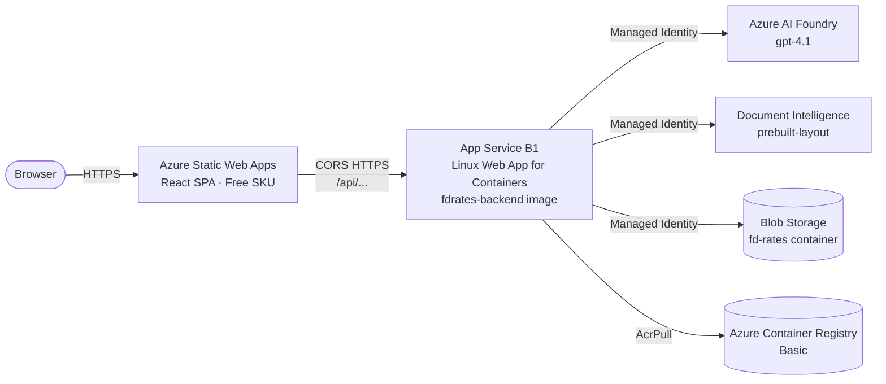
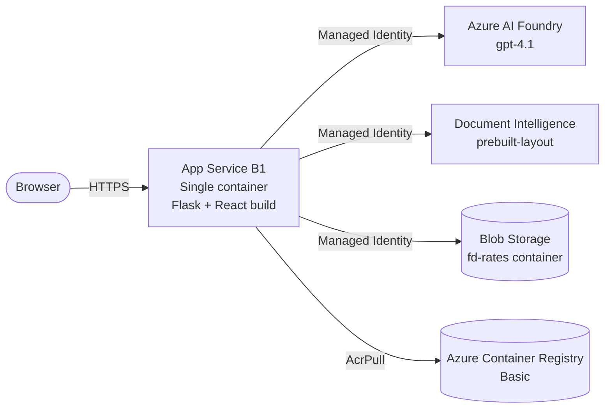
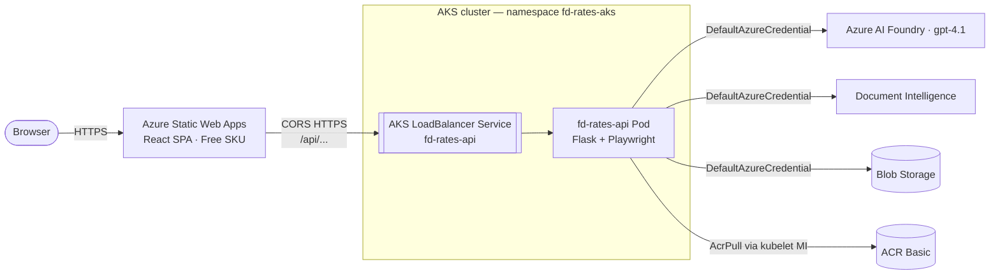
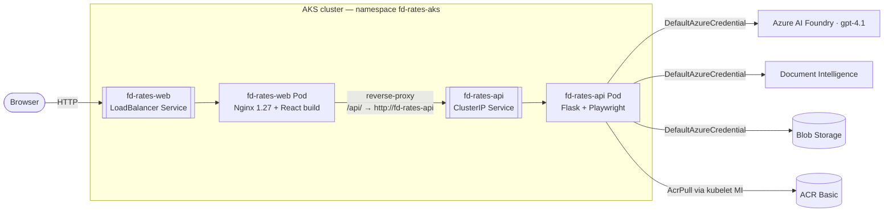

# FD Rate Aggregator

An AI-powered Fixed Deposit rate aggregator for Indian banks. Uses **Azure AI Foundry** (`gpt-4.1`) as an intelligent agent with custom function tools (`fetch_webpage`, `fetch_pdf`, `fetch_image`) to scrape and structure FD rate data from bank websites, linked PDFs, and image rate cards. JS-rendered pages fall back to a **Playwright** headless browser, and PDFs/images are extracted with **Azure AI Document Intelligence** (`prebuilt-layout`). Results are stored in **Azure Blob Storage** and exposed through a **Flask REST API** consumed by a **React** browser UI with a live progress feed.

## Deploy to Azure

Click the button below to provision the full stack into your own Azure subscription. The template provisions storage, AI Foundry + `gpt-4.1`, Document Intelligence, App Insights, an Azure Container Registry, an App Service Plan + Linux Web App for Containers (B1, the **active production host**), an ACA Environment + Container App (optional), and a Static Web App. It also provisions a Bing Grounding resource for optional future integration, but the current backend runtime uses custom function tools (`fetch_webpage`, `fetch_pdf`, `fetch_image`). After the ARM template completes, build and push the backend image via `az acr build`, then wire it to the App Service using `az webapp config container set` (or follow the manual steps in [Production Deployment](#production-deployment)). Note: `deploy.ps1` automates the **Container Apps** path — the live demo was deployed to App Service via Azure Portal Deployment Center.

[](https://portal.azure.com/#create/Microsoft.Template/uri/https%3A%2F%2Fraw.githubusercontent.com%2FKasamShaikh%2Ffd-rates-with-foundary%2Fmaster%2Finfra%2Fmain.json)
[](https://armviz.io/#/?load=https%3A%2F%2Fraw.githubusercontent.com%2FKasamShaikh%2Ffd-rates-with-foundary%2Fmaster%2Finfra%2Fmain.json)

> **Prerequisites for the button:** an Azure subscription with quota for `gpt-4.1` (Sweden Central by default — change `aiLocation` if your quota is elsewhere), `Owner` or `User Access Administrator` rights on the target resource group (RBAC role assignments are part of the template), and the `Microsoft.App`, `Microsoft.CognitiveServices`, `Microsoft.Web`, `Microsoft.ContainerRegistry`, and `Microsoft.Bing` providers registered. The template defaults to `B1` App Service (`deployAppService=true`) as the production host — this is what the live demo uses. Container Apps is provisioned alongside but was ruled out for the live demo due to subscription quota in this region.

## What's New

- **Four deployment topologies, one repo** — see [Architecture (cloud)](#architecture-cloud) for the comparison table and Mermaid diagrams: (A) SWA → App Service, (B) single-container App Service serving the SPA from Flask, (C) SWA → AKS, (D) all-on-AKS with Nginx reverse-proxying `/api/` to a `ClusterIP` backend.
- **SPA-served-from-backend mode** — `backend/Dockerfile` now copies `frontend/build/` into the image, and `backend/dev_server.py` adds a SPA catch-all route. This collapses topology (A) into topology (B) — one App Service, one URL, no CORS, no Static Web App needed. `deploy.ps1` defaults to this same-origin path via `-UseExistingResourcesOnly $true`. Markers: comments tagged `[SPA-SERVE-FROM-BACKEND]`. `.dockerignore` keeps `frontend/build/` inside the build context for this reason.
- **AKS deployment path added** — the app can now be hosted on Azure Kubernetes Service alongside the App Service / Container Apps options. A multi-stage Nginx + React image (`frontend/Dockerfile`, `frontend/nginx.conf`) serves the SPA and reverse-proxies `/api/` to the in-cluster backend Service. New Kubernetes manifests live in `infra/k8s/` (backend Deployment/Service, frontend Deployment/Service, ServiceAccount/Namespace). The end-to-end pipeline is automated by `deploy-aks-swa.ps1` (ensure infra → `az acr build` backend + frontend → render manifests → `kubectl apply` → wait for rollouts → return the frontend LoadBalancer URL). See [AKS deployment](#aks-deployment) below.
- **Production hosting on Azure App Service (Linux Web App for Containers, B1)** — the live demo runs on App Service (`fdrates-web-app-4alomdt3qkjk4`, image `fdrates-backend:20260427-224341`, deployed via Azure Portal Deployment Center). ACA was ruled out due to subscription quota in this region. The Bicep template provisions both; `deploy.ps1` automates the ACA path while the App Service path uses `az webapp config container set` or the Portal Deployment Center.
- **Dynamic tab/accordion expansion in the Playwright fallback** — for rate pages where amount slabs (e.g. ICICI's *"Less than ₹3 Cr."*, *"5 - < 5.10 Cr."*, *"More than 500 Cr."*) live behind unlabelled React `<button>` toggles, the renderer now finds rate-keyword buttons via JS, real-clicks each one with `force=true`, and concatenates the captured snapshots into an injected `<div id="__expanded_tabs__">`. Lifted ICICI extraction from 0 categories / 5,359 chars to 30 rates / 156 KB.
- **PDF asset discovery hardened** — `<object data="…pdf">`, `<embed src="…pdf">`, and `<iframe type="application/pdf">` are now promoted to the top of the asset list (score `+1000`). Fixed Punjab & Sind Bank where the bulk-deposit rate card is exposed only as a `<object>` element.
- **Playwright pinned to base-image version** — `playwright==1.47.0` is now pinned in `requirements.txt` to match `mcr.microsoft.com/playwright/python:v1.47.0-jammy`. Without this pin, pip resolves the latest Playwright while the Docker image only ships the older Chromium, and `BrowserType.launch` silently fails with *"Executable doesn't exist"*. (See troubleshooting table below.)
- **Stop-fetch button** — cancel an in-flight scrape mid-run; the agent loop checks the cancellation flag before each tool call and emits a *"Cancelled by user — partial result"* summary.
- **L1 HTTP cache** — conditional `GET` with `If-None-Match` / `If-Modified-Since` short-circuits the agent when bank pages are unchanged (`304 Not Modified` or sha256 match → reuse cached result, **0 tokens**, **0 DI pages**).
- **robots.txt compliance** — every outbound HTML/PDF/image fetch consults the origin's `/robots.txt` via `urllib.robotparser` (cached per host) and skips disallowed URLs with a warning. Toggle via `ROBOTS_RESPECT=false`; user-agent matched against rules is `ROBOTS_USER_AGENT` (default `FDRateAggregator`). Default-allow on network/parse errors per RFC 9309.
- **Parallel fetching (~2.6× faster)** — bank URLs are processed concurrently with a `ThreadPoolExecutor` (default 4 workers, override via `SCRAPE_MAX_WORKERS`). A single shared Foundry agent is reused across workers, and per-run token usage is aggregated under a `threading.Lock`. End-to-end run for 20 banks dropped from ~527 s to ~201 s in our benchmark.
- **Playwright fallback** — when a static fetch returns too few rate-like signals (e.g. JS-rendered pages), the agent re-fetches via headless Chromium.
- **Document Intelligence integration** — PDF circulars and image-based rate cards are processed with Azure DI `prebuilt-layout`; extracted text is returned to the agent.
- **Live progress log** — every scrape emits real-time events (per-URL start, tool calls, retries, completion). The UI polls `/api/scrape/progress` and shows them in an Activity panel.
- **Total scrape time** — every result payload now includes `elapsed_seconds`; the UI shows `Time: Xm Ys` next to bank/token counts.
- **Selective scraping** — choose specific banks in the URL manager and click "Scrape Selected" instead of running all.
- **Run-id locked activity** — when you press Scrape, the dashboard and activity log clear and the poller locks onto the new `run_id`, ignoring stale events from prior runs.
- **Server-side reset** — the Reset button now also calls `DELETE /api/results/latest`, removing the cached `latest.json` (local + blob) so a refresh will not repopulate the dashboard.
- **Connection-drop recovery** — if the browser fetch times out while the backend is still scraping, the UI polls until the backend reports `running:false` and then loads the result.


---

## Table of Contents

1. [Deploy to Azure](#deploy-to-azure)
2. [Architecture](#architecture)
3. [Azure Resources](#azure-resources)
4. [Project Structure](#project-structure)
5. [File Reference](#file-reference)
6. [Prerequisites](#prerequisites)
7. [Environment Setup](#environment-setup)
8. [Running Locally](#running-locally)
9. [API Reference](#api-reference)
10. [How the Agent Works](#how-the-agent-works)
11. [Data Schema](#data-schema)
12. [UI Features](#ui-features)
13. [Blob Storage Contents](#blob-storage-contents)
14. [Production Deployment](#production-deployment)
15. [Responsible Fetching (robots.txt)](#responsible-fetching-robotstxt)
16. [Change Detection (HTTP cache)](#change-detection-http-cache)
17. [Code Commenting Convention](#code-commenting-convention)
18. [Troubleshooting](#troubleshooting)

---

## Architecture

```
┌─────────────────────────────────────────────────────────────┐
│                      Browser (React UI)                      │
│  localhost:3000  —  custom colour theme                   │
│  - Manage bank URLs          - View rate tables              │
│  - Trigger scrape            - Filter by category            │
│  - Export to Excel           - Token usage display           │
└───────────────────────┬─────────────────────────────────────┘
                        │ HTTP (REST)
                        ▼
┌─────────────────────────────────────────────────────────────┐
│               Flask Dev Server  (backend/dev_server.py)      │
│  localhost:7071  —  CORS-enabled REST API                    │
│  /api/urls   /api/scrape   /api/results   /api/export-excel  │
└───────────────────────┬─────────────────────────────────────┘
                        │ azure-ai-agents SDK
                        ▼
┌─────────────────────────────────────────────────────────────┐
│              Azure AI Foundry Agent  (gpt-4.1)               │
│  Account : web-tools   Project : prj-web-tools               │
│  Region  : South India                                       │
│                                                              │
│  Tools:                                                      │
│    - fetch_webpage(url): HTML text + discovered assets       │
│    - fetch_pdf(url): PDF extraction via Document Intelligence │
│    - fetch_image(url): OCR/image extraction via DI            │
│    → returns ≤15,000 chars of context to the model           │
│                                                              │
│  Manual tool-call loop (up to 8 rounds per bank)             │
│  Emits progress events to a thread-safe ring buffer          │
│  Tracks prompt / completion / total token usage per run      │
└───────────────────────┬─────────────────────────────────────┘
                        │ azure-storage-blob SDK (Entra ID auth)
                        ▼
┌─────────────────────────────────────────────────────────────┐
│           Azure Blob Storage   (fd-rates container)          │
│  Account : fdratesstxf6etxfnua6lq                            │
│  fd_rates_YYYYMMDD_HHMMSS.json   ← timestamped scrape        │
│  latest.json                     ← always latest scrape      │
│  fd_rates_YYYYMMDD_HHMMSS.xlsx   ← timestamped Excel         │
│  latest.xlsx                     ← always latest Excel       │
└─────────────────────────────────────────────────────────────┘
```

---

## Azure Resources

| Resource | Name | Type | Region |
|---|---|---|---|
| AI Services account | `web-tools` | Azure AI Services (Cognitive Services) | South India |
| AI Foundry project | `prj-web-tools` | AI Foundry Project | South India |
| Model deployment | `gpt-4.1` | Azure OpenAI gpt-4.1 | South India |
| Document Intelligence | `fdrates-di-kvihlu` | Azure AI Document Intelligence (`prebuilt-layout`) | Central India |
| Resource group (AI) | `demo-web-tool` | Resource Group | — |
| Storage account | `fdratesstxf6etxfnua6lq` | Storage V2 Standard LRS | Central India |
| Blob container | `fd-rates` | Blob Container | — |
| Resource group (storage) | `rg-fd-rates` | Resource Group | Central India |

### Project endpoint

```
https://web-tools.services.ai.azure.com/api/projects/prj-web-tools
```

### Authentication

All Azure SDK calls use **`DefaultAzureCredential`**, which resolves to `AzureCliCredential` during local development. No connection strings or API keys are stored in code.

Required RBAC role on the storage account:

```
Role  : Storage Blob Data Contributor
Scope : /subscriptions/<YOUR_SUBSCRIPTION_ID>
          /resourceGroups/rg-fd-rates
          /providers/Microsoft.Storage/storageAccounts/fdratesstxf6etxfnua6lq
```

---

## Project Structure

```
fd-rates-with-foundary/
├── .env                        ← Local secrets (not committed)
├── .env.template               ← Template — copy to .env and fill in
├── .gitignore
├── setup.ps1                   ← PowerShell provisioning script
├── README.md
│
├── backend/
│   ├── dev_server.py           ← Flask REST API (local dev server)
│   ├── function_app.py         ← Azure Functions v2 (Python) — production
│   ├── host.json               ← Azure Functions host config
│   ├── local.settings.json     ← Optional local Functions settings (not committed)
│   ├── requirements.txt        ← Python dependencies
│   ├── urls.json               ← Persisted bank URL list (20 banks)
│   ├── _local_results/         ← Local JSON/Excel result cache (dev only, gitignored)
│   └── agent/
│       ├── __init__.py
│       ├── fd_rate_agent.py    ← Core Foundry agent + tool-call loop
│       ├── dynamic_fetch.py    ← Playwright headless Chromium renderer
│       ├── asset_extractors.py ← Azure DI `prebuilt-layout` for PDFs / images
│       ├── progress.py         ← Thread-safe live progress event buffer
│       └── robots.py           ← robots.txt compliance (cached, thread-safe)
│
├── frontend/
│   ├── package.json
│   └── src/
│       ├── App.js              ← Root component, state, API calls
│       ├── App.css             ← Global styles (custom colour theme)
│       ├── index.js
│       └── components/
│           ├── UrlManager.js       ← Add / delete / select bank URLs
│           ├── ScrapeButton.js     ← Trigger scrape ("Scrape All" / "Scrape Selected")
│           ├── ExportButton.js     ← Trigger Excel export
│           ├── ProgressLog.js     ← Live activity log (run-id locked)
│           └── ResultsDashboard.js ← Rate tables + token usage + elapsed time
│
└── infra/
    ├── main.bicep              ← Full infrastructure (storage, functions, AI)
    └── project-only.bicep      ← AI Foundry project only
```

---

## File Reference

### `backend/agent/fd_rate_agent.py`

Core AI agent module.

| Function | Purpose |
|---|---|
| `create_agent(agents_client)` | Creates a Foundry agent with `gpt-4.1` and registers `fetch_webpage`, `fetch_pdf`, and `fetch_image` function tool schemas |
| `fetch_webpage_handler(url)` | Three-tier fetch: (1) `requests.get` + BeautifulSoup; (2) if rate-like signals (`%`) below `MIN_PERCENT_SIGNS=20`, re-render with Playwright; (3) if URL is `.pdf` or image, run Document Intelligence `prebuilt-layout`. Returns ≤ 15,000 chars of visible text and emits per-URL progress events. |
| `scrape_bank_url(...)` | Creates a thread, sends a user message, manually polls `run.status`, handles `requires_action` tool call rounds (max 8), captures `run.usage` token counts |
| `_parse_agent_response(...)` | Strips markdown fences, attempts `json.loads()`, falls back to substring extraction between first `{` and last `}`, triggers a single auto-retry if both fail |
| `scrape_all_urls(urls)` | Creates a single shared `AgentsClient` + agent, dispatches each bank to a `ThreadPoolExecutor` (default 4 workers, configurable via `SCRAPE_MAX_WORKERS` env var), aggregates token usage under a thread lock, deletes the agent on completion, returns `{"results": [...], "token_usage": {...}, "elapsed_seconds": float}`. Results are kept in input order. |

**Tool call loop detail:**

```
runs.create()
  → poll while "queued" / "in_progress"
  → while status == "requires_action":
        for each tool_call in required_action.submit_tool_outputs.tool_calls:
          dispatch by tool name:
          fetch_webpage -> fetch_webpage_handler
          fetch_pdf -> extract_pdf
          fetch_image -> extract_image
      runs.submit_tool_outputs(tool_outputs)
      poll again
  → capture run.usage
  → read assistant messages
```

---

### `backend/agent/dynamic_fetch.py`

Playwright-based fallback renderer. Launches a headless Chromium browser, navigates to the URL with `wait_until="networkidle"`, returns the rendered HTML / extracted text. Triggered by `fetch_webpage_handler` when a static fetch yields fewer than `MIN_PERCENT_SIGNS=20` `%` characters (a heuristic for rate tables).

### `backend/agent/asset_extractors.py`

Azure AI Document Intelligence wrapper. Uses the `prebuilt-layout` model to OCR PDFs and image-based rate cards. Endpoint configured via `DOC_INTELLIGENCE_ENDPOINT` env var; auth via `DefaultAzureCredential` (requires `Cognitive Services User` role on the DI resource).

### `backend/agent/progress.py`

Thread-safe live progress event buffer. Exposes:

- `reset(total)` — clears buffer, assigns a fresh `run_id` (UUID), marks `running=True`.
- `log(message)` — appends `{ts, message}` event.
- `mark_done()` — sets `running=False`.
- `snapshot(since=N)` — returns `{run_id, running, total, events[since:]}` for incremental polling.

### `backend/agent/robots.py`

Wraps `urllib.robotparser.RobotFileParser` with a thread-safe per-origin in-memory cache. Exposes:

- `is_allowed(url) -> (bool, reason)` — returns `(True, "allowed by robots.txt")` or `(False, "disallowed by robots.txt for UA '...'")`. On network/parse error, returns `(True, "robots.txt unavailable")` per RFC 9309.

Config: `ROBOTS_RESPECT` (default `true`) and `ROBOTS_USER_AGENT` (default `FDRateAggregator`). See [Responsible Fetching](#responsible-fetching-robotstxt) for full details.

---

### `backend/dev_server.py`

Flask application serving the REST API on port **7071**. Mirrors the Azure Functions API surface so the React frontend works identically in both local dev and production.

Key implementation details:

- `CORS(app, origins=["http://localhost:3000"])` — allows cross-origin requests from the React dev server
- `_get_blob_service_client()` — creates `BlobServiceClient` using account URL from `STORAGE_ACCOUNT_NAME` env var + `DefaultAzureCredential`
- `_upload_to_blob(blob_name, data, content_type)` — uploads bytes to `BLOB_CONTAINER` with `overwrite=True`
- `scrape_all()` — accepts optional `{"urls": [...]}` body for selective scraping, wraps `scrape_all_urls()` with a `time.monotonic()` timer, unpacks `{"results": ..., "token_usage": ...}`, adds `elapsed_seconds`, uploads to blob as both timestamped and `latest.json`
- `scrape_progress()` — `GET /api/scrape/progress?since=N` returns `{run_id, running, total, events}` from the in-memory buffer
- `delete_latest()` — `DELETE /api/results/latest` removes the local `latest.json` and the blob `latest.json`
- `export_excel()` — generates `openpyxl` workbook with per-bank sheets, styled headers, alternating row colours, auto-filter; uploads as timestamped + `latest.xlsx`

---

### `backend/function_app.py`

Azure Functions (Python v2 programming model) equivalent of `dev_server.py`. Same API surface and same blob/agent logic, deployed to Azure Functions for production. Uses `func.FunctionApp(http_auth_level=func.AuthLevel.ANONYMOUS)`.

---

### `backend/urls.json`

Persisted list of bank URLs. Managed via the `/api/urls` endpoints. Default content:

```json
[
  {
    "id": "...",
    "url": "https://www.hdfc.bank.in/interest-rates",
    "bank_name": "HDFC",
    "created_at": "..."
  },
  {
    "id": "...",
    "url": "https://www.indusind.bank.in/in/en/personal/rates.html",
    "bank_name": "IndusInd",
    "created_at": "..."
  },
  {
    "id": "...",
    "url": "https://sbi.co.in/web/interest-rates/deposit-rates/retail-domestic-term-deposits",
    "bank_name": "SBI",
    "created_at": "..."
  }
]
```

---

### `backend/host.json`

Azure Functions v2 host configuration. Extension bundle `[4.*, 5.0.0)`, route prefix `api`.

---

### `.env` / `.env.template`

Local environment variables for the Flask dev server (and shared backend code) are loaded from the project-root `.env` file. Copy `.env.template` to `.env` and set values.

| Key | Value |
|---|---|
| `PROJECT_ENDPOINT` | `https://<your-ai-services>.services.ai.azure.com/api/projects/<project-name>` |
| `MODEL_DEPLOYMENT_NAME` | `gpt-4.1` |
| `BLOB_CONTAINER_NAME` | `fd-rates` |
| `STORAGE_ACCOUNT_NAME` | `<your-storage-account-name>` |
| `DOC_INTELLIGENCE_ENDPOINT` | `https://<your-di-resource>.cognitiveservices.azure.com/` |

---

### `frontend/src/App.js`

Root React component. State:
- `urls` — configured bank URL list
- `results` — last scrape payload including `token_usage`
- `scraping` / `exporting` — loading flags for spinner display
- `message` — status bar text

All API calls use `REACT_APP_API_BASE_URL` (defaults to `http://localhost:7071`).

---

### `frontend/src/components/ResultsDashboard.js`

Right panel rendering:
- **Token usage bar** — maroon gradient banner; shows `total`, `prompt`, `completion` tokens when `results.token_usage` is present
- **Category filter chips** — derived from all unique `category_name` values across all bank results
- **Bank sections** — collapsible per-bank cards with rate tables (`Tenor`, `Min Days`, `Max Days`, `Rate (%)`, `Info`)

---

### `frontend/src/App.css`

custom colour theme via CSS custom properties:

| Variable | Hex | Usage |
|---|---|---|
| `--primary` | `#97144D` | Buttons, table headers, active filter chips |
| `--primary-dark` | `#6B0E37` | Hover states, page header gradient start |
| `--primary-light` | `#C4547A` | Page header gradient end |
| `--accent` | `#12877F` | Export (Excel) button, accent elements |
| `--bg` | `#FDF5F8` | Page background |
| `--border` | `#e8d0db` | Card and table borders |

---

### `infra/main.bicep`

Full infrastructure-as-code template. Provisions:

| Resource | Naming pattern |
|---|---|
| Storage account | `${baseName}st${uniqueString(resourceGroup().id)}` |
| Blob container | `fd-rates` |
| App Service Plan | `${baseName}-plan-${uniqueSuffix}` |
| Azure Functions app | `${baseName}-func-${uniqueSuffix}` |
| Application Insights | `${baseName}-insights-${uniqueSuffix}` |
| Log Analytics workspace | `${baseName}-logs-${uniqueSuffix}` |
| AI Services account | `${baseName}-ai-${uniqueSuffix}` |
| AI Foundry project | `${baseName}-project` |

Parameters: `baseName` (default `fdrates`), `location` (default `centralindia`), `aiLocation` (default `centralindia`).

---

### `.env` / `.env.template`

```env
# Azure Subscription
AZURE_SUBSCRIPTION_ID=<YOUR_SUBSCRIPTION_ID>
AZURE_RESOURCE_GROUP=rg-fd-rates
AZURE_LOCATION=centralindia

# Azure AI Foundry
PROJECT_ENDPOINT=https://web-tools.services.ai.azure.com/api/projects/prj-web-tools
MODEL_DEPLOYMENT_NAME=gpt-4.1

# Azure Blob Storage
STORAGE_ACCOUNT_NAME=fdratesstxf6etxfnua6lq
BLOB_CONTAINER_NAME=fd-rates

# Frontend (React)
REACT_APP_API_BASE_URL=http://localhost:7071
```

---

## Prerequisites

| Requirement | Notes |
|---|---|
| Python 3.11+ | Tested on 3.11 |
| Node.js 18+ | For the React frontend |
| Azure CLI | `az login --use-device-code` before running |
| Azure AI Services quota | `gpt-4.1` in South India |
| Storage Blob Data Contributor | RBAC role assigned on the storage account |

---

## Environment Setup

### 1. Clone and configure

```powershell
git clone <repo-url>
cd fd-rates-with-foundary
Copy-Item .env.template .env
# Edit .env with your values
```

### 2. Azure login

```powershell
az login --use-device-code
az account set --subscription <YOUR_SUBSCRIPTION_ID>
```

### 3. Backend — Python virtual environment

```powershell
cd backend
python -m venv .venv
.\.venv\Scripts\Activate.ps1
pip install -r requirements.txt
pip install flask flask-cors requests beautifulsoup4
# Install the headless Chromium used by the Playwright fallback
python -m playwright install chromium
```

### 4. Frontend — Node dependencies

```powershell
cd ..\frontend
npm install
```

---

## Running Locally

### Start the backend

```powershell
cd backend
.\.venv\Scripts\Activate.ps1
$env:DOC_INTELLIGENCE_ENDPOINT = "https://fdrates-di-kvihlu.cognitiveservices.azure.com/"
python dev_server.py
# API available at http://localhost:7071
```

### Start the frontend

```powershell
cd frontend
npm start
# UI available at http://localhost:3000
```

### Kill an already-running backend and restart (PowerShell)

```powershell
$conn = Get-NetTCPConnection -LocalPort 7071 -ErrorAction SilentlyContinue | Select-Object -First 1
if ($conn) { Stop-Process -Id $conn.OwningProcess -Force -ErrorAction SilentlyContinue }
Set-Location backend
python dev_server.py
```

---

## API Reference

### `GET /api/urls`

Returns all configured bank URLs.

```json
[
  {
    "id": "e1a5f657-dedf-4396-86a0-77bea729081b",
    "url": "https://www.hdfc.bank.in/interest-rates",
    "bank_name": "HDFC",
    "created_at": "2026-04-21T04:57:36.183203+00:00"
  }
]
```

### `POST /api/urls`

Add a bank URL.

```json
{ "url": "https://...", "bank_name": "Your Bank" }
```

### `DELETE /api/urls/{id}`

Remove a bank URL by its UUID.

### `POST /api/scrape`

Trigger a full agent scrape across all configured URLs, or pass a JSON body to scrape a subset:

```json
{ "urls": ["<url-id-1>", "<url-id-2>"] }
```

Response:

```json
{
  "scraped_at": "2026-04-21T07:48:00+00:00",
  "bank_count": 20,
  "elapsed_seconds": 636.4,
  "token_usage": {
    "prompt_tokens": 105563,
    "completion_tokens": 35819,
    "total_tokens": 141382
  },
  "di_pages": 2,
  "results": [ ... ]
}
```

Also uploads `fd_rates_<timestamp>.json` and `latest.json` to blob storage.

### `GET /api/scrape/progress?since=N`

Returns the live progress buffer for the most recent (or in-flight) scrape:

```json
{
  "run_id": "a1b2c3d4-...",
  "running": true,
  "total": 20,
  "events": [
    { "ts": "2026-04-25T19:42:01Z", "message": "[1/20] HDFC — fetching https://..." },
    { "ts": "2026-04-25T19:42:08Z", "message": "[1/20] HDFC — Playwright fallback (signals=4)" }
  ]
}
```

Clients pass `since` (the index of the last event already received) for incremental polling. `run_id` changes on every new scrape; clients should clear local state when it does.

### `GET /api/results/latest`

Returns the cached result from the most recent scrape (same shape as `/api/scrape`).

### `DELETE /api/results/latest`

Clears the cached result. Removes both the local `latest.json` and the blob `latest.json`. Used by the UI's Reset button so a page refresh does not repopulate the dashboard.

```json
{
  "message": "Latest result cleared",
  "removed_local": true,
  "removed_blob": true
}
```

### `POST /api/export-excel`

Generates a formatted Excel workbook and uploads it to blob storage.

```json
{
  "message": "Excel exported successfully",
  "blob_name": "fd_rates_20260421_074832.xlsx",
  "latest_blob": "latest.xlsx",
  "bank_count": 3,
  "exported_at": "2026-04-21T07:48:32+00:00"
}
```

---

## How the Agent Works

1. **Agent creation** — a Foundry agent is created with `gpt-4.1` and three registered function tools: `fetch_webpage(url)`, `fetch_pdf(url)`, and `fetch_image(url)`.

2. **Thread per bank** — each bank gets its own conversation thread. The user message instructs the agent to extract all FD rate information from the given URL and return it as structured JSON.

3. **Tool call loop** — up to **8 rounds** per bank:
  - The model decides which tool to call (`fetch_webpage`, `fetch_pdf`, `fetch_image`)
  - `fetch_webpage_handler` fetches and cleans HTML text, discovers PDF/image assets, and can trigger Playwright re-render for JS-heavy pages
  - `fetch_pdf` / `fetch_image` extract text/tables using Azure DI `prebuilt-layout`
  - Tool outputs are submitted and the model continues reasoning until completion

4. **Token tracking** — `run.usage.prompt_tokens`, `run.usage.completion_tokens`, and `run.usage.total_tokens` are captured after each run completion and aggregated across all banks and retry attempts.

5. **JSON extraction** — the assistant's final text message is cleaned and parsed:
   - Strip markdown code fences (` ```json ... ``` `)
   - Attempt `json.loads()`
   - Fallback: extract text between first `{` and last `}`
   - If still invalid: ask the model to reformat as strict compact JSON (one retry)

6. **Cleanup** — the Foundry agent is deleted via `agents_client.delete_agent()` after all banks are processed.

---

## Data Schema

Each bank result in `results`:

```json
{
  "bank_name": "HDFC",
  "url": "https://www.hdfc.bank.in/interest-rates",
  "effective_date": "2026-03-06",
  "categories": [
    {
      "category_name": "General Public",
      "amount_slab": "Less than 3 Cr",
      "scheme_name": null,
      "rates": [
        {
          "tenor_description": "7 - 14 days",
          "min_days": 7,
          "max_days": 14,
          "rate_percent": 2.75,
          "additional_info": null
        }
      ]
    }
  ]
}
```

On extraction failure:

```json
{
  "error": "Could not extract rates",
  "bank_name": "XYZ Bank",
  "url": "https://...",
  "reason": "Page content not parseable"
}
```

---

## UI Features

| Feature | Detail |
|---|---|
| Bank URL management | Sidebar form — add bank name + URL, delete individual entries, **select** banks via checkbox; persisted to `backend/urls.json` |
| Scrape All / Scrape Selected | Button label switches based on selection; calls `POST /api/scrape` (no body = all, body `{urls:[...]}` = selected). Shows spinner and disables button during execution. |
| Live Activity Log | Polls `GET /api/scrape/progress?since=N` every 2s; shows per-URL fetch events, Playwright fallbacks, DI page extracts, retry attempts, completion. Locked to the current `run_id` so stale events from the prior run never bleed into the next. |
| Results Dashboard | Per-bank collapsible sections with full rate tables (Tenor / Min Days / Max Days / Rate / Info); meta-info bar shows `Banks: N · Tokens: X · Time: Xm Ys`. |
| Category filter chips | Auto-generated from scraped data; filter across all banks simultaneously |
| Token usage bar | Maroon gradient banner: `total · prompt · completion` tokens from the last scrape |
| Reset | Clears dashboard + activity log AND calls `DELETE /api/results/latest` so a refresh does not repopulate. |
| Connection-drop recovery | If the long fetch to `/api/scrape` gets dropped by the dev proxy, the UI falls back to polling `/api/scrape/progress` until `running:false`, then loads `/api/results/latest`. |
| Write Excel | Calls `POST /api/export-excel`; shows uploaded blob name in the status bar |
| custom colour theme | Primary maroon `#97144D`, teal accent `#12877F`, blush background `#FDF5F8` |

---

## Blob Storage Contents

After a full scrape + export cycle the `fd-rates` container holds:

```
fd_rates_20260421_074454.json   ← archived scrape result
fd_rates_20260421_074832.xlsx   ← archived Excel workbook
latest.json                     ← always the most recent scrape
latest.xlsx                     ← always the most recent Excel file
```

Files are uploaded using `DefaultAzureCredential`. The `Storage Blob Data Contributor` role is required on the storage account. No SAS tokens or connection strings are used.

---

## Production Deployment

The cloud stack runs the **Flask backend in a container**, the **React frontend on Azure Static Web Apps** (Free SKU), and persists results to **Azure Blob Storage**. Two backend hosting paths are supported by `infra/main.bicep` — pick whichever your subscription has quota for:

| Path | When to use | SKU | Cold start | Cost (idle) |
|---|---|---|---|---|
| **App Service Plan + Linux Web App for Containers** *(default for the live demo)* | Subscriptions without Container Apps quota in the chosen region. Always-on, no scale-to-zero. | `B1` (1 vCPU / 1.75 GB) — bump to `P0v3`/`P1v3` for production | None | ~$13/mo |
| **Azure Container Apps (Consumption, scale-to-zero)** | Best when ACA quota is available — pay-per-second, scales to zero between scrapes. | 0.5 vCPU / 1 GiB, 0–2 replicas | 1–3 s | $0–$2/mo |

Both paths share the same image, the same managed identity, and the same RBAC.

### Why a container (not Azure Functions)

- **Playwright (headless Chromium)** needs a full container — Functions Consumption cannot host it reliably.
- Scrape runs can take **>230 s**, exceeding the Functions Consumption HTTP timeout.
- The Functions entry-point (`backend/function_app.py`) is retained for reference but is **not** the deployment target. The cloud path runs Flask (`dev_server.py`) under `gunicorn` inside the container.

### Architecture (cloud)

The same backend code, the same React frontend, and the same Azure AI / Storage / Document Intelligence dependencies can be deployed in four different topologies depending on quota, network posture, and operational preference. Pick one — they are all wired up in this repo.

| # | Topology | Frontend host | Backend host | Driver | Public endpoint(s) |
|---|---|---|---|---|---|
| **A** | **SWA → App Service** *(original live demo)* | Azure Static Web Apps (Free) | App Service B1 (Linux Web App for Containers) | `infra/main.bicep` + `az webapp config container set` | SWA URL + Web App URL (CORS-allowed) |
| **B** | **Single-container App Service** *(current default in `deploy.ps1`)* | Served by Flask from `/static` inside the backend container | App Service B1 (same container) | `deploy.ps1` (`UseExistingResourcesOnly=$true`) | App Service URL only (same-origin, no CORS) |
| **C** | **SWA → AKS** | Azure Static Web Apps (Free) | AKS pod, exposed by `LoadBalancer` Service | `deploy-aks-swa.ps1` (backend image only) + manual SWA build | SWA URL + AKS LB IP (CORS-allowed) |
| **D** | **All-on-AKS** *(current AKS demo)* | Nginx + React pod inside AKS, reverse-proxies `/api/` to backend | AKS pod, exposed only as `ClusterIP` | `deploy-aks-swa.ps1` (full pipeline) | Single AKS `LoadBalancer` IP |

#### A — SWA → App Service (CORS, two URLs)



#### B — Single-container App Service (SPA served by Flask, same-origin)

`backend/Dockerfile` copies `frontend/build/` into `/app/static`, and `backend/dev_server.py` adds a catch-all route that returns the SPA's `index.html` for any non-`/api/` path. No SWA is needed; the React app issues same-origin `/api/...` calls so the browser never sees CORS.



#### C — SWA → AKS (frontend on CDN, backend in cluster)



#### D — All-on-AKS (single LoadBalancer, no public API)

The frontend pod runs Nginx 1.27 with the React build baked in. Nginx terminates the public request, returns static assets directly, and reverse-proxies anything under `/api/` to the in-cluster backend Service. The backend Service is `ClusterIP`, so the API is never directly reachable from the internet.



Image registry: **Azure Container Registry (Basic SKU)** is shared across all four topologies. Images are tagged with the deployment timestamp; the backend's managed identity (App Service system-assigned MI, or AKS kubelet user-assigned MI) holds `AcrPull` against the registry, so no admin user / passwords are stored.

### One-click deploy (Azure Portal)

The fastest path is the **[Deploy to Azure](#deploy-to-azure)** button at the top of this README. It opens the Azure Portal pre-loaded with `infra/main.json` (the compiled ARM template). You'll be asked for:

| Parameter | Default | Notes |
|---|---|---|
| `baseName` | `fdrates` | Used as the prefix for every resource name. |
| `location` | `centralindia` | Region for storage / container / web. |
| `aiLocation` | `swedencentral` | Region for `gpt-4.1`. **Must match a region where you hold model quota.** |
| `swaLocation` | `eastasia` | Static Web App region (Free SKU is restricted). |
| `deployAppService` | `true` | Set to `false` to skip the App Service plan and use only Container Apps. |
| `useAcrImage` | `false` | Keep `false` for the first deploy (uses the public quickstart image as a placeholder). Re-deploy with `true` after `az acr build` finishes. |

After the ARM deploy succeeds the Container App / Web App is running the **bootstrap quickstart image**. Continue with the [Re-deploy code only](#re-deploy-code-only) section to push your real backend image and the React build.

### One-shot scripted deployment (Container Apps path)

```powershell
az login
az account set --subscription <SUBSCRIPTION_ID>

# Provision + build image + push + deploy frontend via Container Apps
pwsh ./deploy.ps1 -ResourceGroup rg-fd-rates -Location centralindia
```

`deploy.ps1` runs three Bicep passes (bootstrap → switch to ACR image → set CORS to the SWA URL), invokes `az acr build` to build the image inside Azure Container Registry (no local Docker daemon required), then builds the React app with `REACT_APP_API_BASE_URL` baked in and pushes it to Static Web Apps via `swa deploy`. **This script targets Container Apps.** The live demo uses App Service instead — see [Re-deploy code only](#re-deploy-code-only) for the App Service commands.

### App Service deployment (active live path)

```powershell
$tag = Get-Date -Format 'yyyyMMdd-HHmmss'
az acr build --registry <acr-name> --image "fdrates-backend:$tag" `
    --file backend/Dockerfile .

az webapp config container set --name <web-app-name> --resource-group <rg> `
    --container-image-name "<acr-name>.azurecr.io/fdrates-backend:$tag"
az webapp restart --name <web-app-name> --resource-group <rg>
```

### What gets provisioned

| Resource | SKU | Purpose |
|---|---|---|
| Azure Container Registry | Basic | Stores `fdrates-backend:<tag>` |
| Container Apps Environment + Container App | Consumption, 0–2 replicas | Optional backend host (scale-to-zero) |
| App Service Plan + Linux Web App for Containers | `B1` Linux | Default backend host (always-on) |
| Static Web App | Free | React build, global CDN |
| Storage Account | Standard LRS | `fd-rates` blob container |
| AI Services + AI Foundry project | S0 | `gpt-4.1` deployment + agents |
| Document Intelligence | S0 | `prebuilt-layout` for PDFs/images |
| Bing Grounding | G1 | Provisioned for optional future web-grounding integration (not used by current backend tool loop) |
| Log Analytics + App Insights | Pay-as-you-go | Telemetry |

### Environment variables on the backend

Set automatically by the Bicep template — no manual configuration:

- `STORAGE_ACCOUNT_NAME`, `BLOB_CONTAINER_NAME`
- `PROJECT_ENDPOINT`, `MODEL_DEPLOYMENT_NAME=gpt-4.1`
- `DOC_INTELLIGENCE_ENDPOINT`
- `ALLOWED_ORIGINS` (= the SWA URL — used by Flask CORS)
- `LOCAL_RESULTS_ENABLED=false` (forces blob-only persistence)
- `APPLICATIONINSIGHTS_CONNECTION_STRING`

### RBAC (auto-assigned to the backend's managed identity)

- **Storage Blob Data Contributor** on the storage account
- **Cognitive Services OpenAI User** on the AI Services account
- **Azure AI Developer** on the AI Services account
- **Cognitive Services User** on Document Intelligence
- **AcrPull** on the Container Registry

### Cost estimate (demo workload, idle most of the day)

| Item | App Service B1 | Container Apps |
|---|---|---|
| Backend hosting | ~$13/mo (24×7 B1) | $0–$2/mo (scale-to-zero) |
| Container Registry (Basic) | $5 | $5 |
| Static Web Apps (Free) | $0 | $0 |
| Storage / App Insights / Log Analytics | < $1.50 | < $1.50 |
| **Hosting subtotal** | **~$20 / month** | **~$7 / month** |
| AI Foundry `gpt-4.1` tokens | per token | per token |
| Document Intelligence pages | per page | per page |

Switch ACR Basic to ghcr.io / Docker Hub if the $5/month is unwelcome — drop the ACR resource from `infra/main.bicep` and set `containerApp.template.containers[0].image` (or `linuxFxVersion`) to the public image reference.

### Re-deploy code only

After the first full deploy, subsequent backend code changes only need an image rebuild:

```powershell
$tag = Get-Date -Format 'yyyyMMdd-HHmmss'
az acr build --registry <acr-name> --image "fdrates-backend:$tag" `
    --file backend/Dockerfile .

# App Service path
az webapp config container set --name <web-app-name> --resource-group <rg> `
    --container-image-name "<acr-name>.azurecr.io/fdrates-backend:$tag"
az webapp restart --name <web-app-name> --resource-group <rg>

# Container Apps path
az containerapp update --name fdrates-api --resource-group <rg> `
    --image "<acr-name>.azurecr.io/fdrates-backend:$tag"
```

Frontend-only changes:

```powershell
cd frontend
$env:REACT_APP_API_BASE_URL = 'https://<backend-fqdn>'
npm run build
swa deploy ./build --deployment-token <token> --env production
```

### Live demo (current deployment)

| Component | Resource | URL |
|---|---|---|
| Frontend | Static Web App `fdrates-web-4alomdt3qkjk4` | https://wonderful-rock-0bdceac00.7.azurestaticapps.net |
| Backend | App Service `fdrates-web-app-4alomdt3qkjk4` (B1 Linux) | https://fdrates-web-app-4alomdt3qkjk4.azurewebsites.net |
| Image | ACR `fdratesacr4alomdt3qkjk4.azurecr.io/fdrates-backend:<timestamp>` | — |
| Resource group | `rg-fd-rates-aca` (centralindia) | — |

### AKS deployment

An alternative hosting path runs the full stack on **Azure Kubernetes Service**: the backend (Flask + Playwright + Document Intelligence) and the React SPA (served by Nginx) both run as pods inside the cluster. Only the frontend Service is publicly exposed as a `LoadBalancer`; it reverse-proxies `/api/` to the backend's in-cluster `ClusterIP` Service. This keeps the API off the public internet while still serving the SPA from a single origin (no CORS).

Files involved:

| File | Purpose |
|---|---|
| `frontend/Dockerfile` | Multi-stage build — Node 20 builds the React app, Nginx 1.27 serves `/build` and proxies `/api/` to the backend. |
| `frontend/nginx.conf` | Listens on `:80`; `location /api/ → proxy_pass http://fd-rates-api`; SPA fallback (`try_files $uri /index.html`). |
| `infra/k8s/serviceaccount.yaml` | Namespace + `fd-rates-sa` ServiceAccount (with placeholder for an optional workload-identity annotation). |
| `infra/k8s/deployment.yaml` | Backend `fd-rates-api` Deployment, env vars for `STORAGE_ACCOUNT_NAME`, `PROJECT_ENDPOINT`, `MODEL_DEPLOYMENT_NAME`, `DOC_INTELLIGENCE_ENDPOINT`, `ALLOWED_ORIGINS`. |
| `infra/k8s/service.yaml` | Backend Service `fd-rates-api` — type `ClusterIP` (internal only). |
| `infra/k8s/frontend-deployment.yaml` | Frontend `fd-rates-web` Deployment (Nginx + React image). |
| `infra/k8s/frontend-service.yaml` | Frontend Service `fd-rates-web` — type `LoadBalancer` (public). |
| `infra/aks-swa.bicep` | AKS cluster + ACR + supporting infra for this path. |
| `deploy-aks-swa.ps1` | End-to-end deployment pipeline. |

Pipeline (`deploy-aks-swa.ps1`):

1. Ensure / deploy `infra/aks-swa.bicep` into the target resource group.
2. Start the AKS cluster if it is stopped, attach ACR via `az aks update --attach-acr`, and merge kubeconfig (`az aks get-credentials`).
3. `az acr build` for the backend image (`fdrates-backend:<tag>`).
4. `az acr build` for the frontend image (`fdrates-frontend:<tag>`).
5. Render the YAML manifests, substituting `__NAMESPACE__`, `__IMAGE__`, `__FRONTEND_IMAGE__`, `__STORAGE_ACCOUNT_NAME__`, `__PROJECT_ENDPOINT__`, `__DOC_INTELLIGENCE_ENDPOINT__`, `__ALLOWED_ORIGINS__`, and the workload-identity placeholders.
6. `kubectl apply -f` for each manifest.
7. `kubectl rollout status` on both Deployments.
8. Poll `kubectl get svc fd-rates-web` until the `LoadBalancer` IP is assigned and print `http://<ip>/` as the public URL.

Quick run:

```powershell
az login
az account set --subscription <SUBSCRIPTION_ID>

pwsh ./deploy-aks-swa.ps1 -ResourceGroup rg-fd-rates-aca -Location centralindia -SkipWhatIf
```

> **Federated identity / workload identity:** if your tenant does not allow federated identity credentials, run the script **without** the `-EnableWorkloadIdentity` switch. The cluster + ACR attach (`az aks update --attach-acr`) still works for image pull, but the backend pod will not have an Entra-token credential source. In that case either (a) switch the backend to API keys for Storage / AI Services / Document Intelligence, or (b) grant the AKS kubelet user-assigned managed identity the required RBAC roles so `DefaultAzureCredential` can use IMDS.

Live AKS test instance (sample run): `http://20.204.251.67/` (frontend `LoadBalancer` IP from `fdratesaks-aks-zjyxlol22toso`, namespace `fd-rates-aks`).

---

## Responsible Fetching (`robots.txt`)

Every outbound HTTP request the agent makes — HTML page fetches, Playwright re-renders, and PDF/image downloads — first consults the origin's `/robots.txt`. Disallowed URLs are skipped **before** any network call is made and **before** any agent tokens are spent.

### How it works

`backend/agent/robots.py` wraps Python's standard `urllib.robotparser.RobotFileParser` with:

- **Per-origin in-memory cache** — `robots.txt` is fetched once per process per host, then re-used across all subsequent calls (and worker threads).
- **Thread-safe** — guarded by a `threading.Lock`, safe for the parallel ThreadPoolExecutor.
- **Fail-open by RFC 9309** — if `robots.txt` returns 4xx, treat as allow-all; if it returns 5xx / network error / parse error, default-allow with a warning.
- **8-second timeout** on the `robots.txt` fetch itself.

### Where it's enforced

1. **Pre-flight per bank** in `scrape_all_urls._scrape_one()` — short-circuits before creating a thread, so blocked banks consume **zero** agent tokens.
2. **Defense-in-depth in `fetch_webpage_handler()`** — guards `requests.get()` and the Playwright fallback.
3. **Defense-in-depth in `asset_extractors._download()`** — guards every PDF and image download triggered by the `fetch_pdf` / `fetch_image` tools.

### Configuration

| Env var | Default | Purpose |
|---|---|---|
| `ROBOTS_RESPECT` | `true` | Set to `false`/`0`/`no`/`off` to bypass entirely (not recommended for production). |
| `ROBOTS_USER_AGENT` | `FDRateAggregator` | User-agent string matched against `User-agent:` rules in the bank's `robots.txt`. Most bank sites use `*` rules, which always match. |

### What the user sees when blocked

- **Activity log (live)** — amber `⛔` warning with the URL, the reason, and the override hint.
- **Summary tab** — a distinct **"⛔ Blocked"** pill (separate from "✖ Failed") and the reason inline.
- **Rates tab → expanded bank** — amber callout: *"Blocked by robots.txt — no fetch was attempted, no tokens used."*
- **JSON result** — `{"blocked_by_robots": true, "error": "Blocked by robots.txt", "reason": "..."}`.

### Verifying compliance

```powershell
# Test against a real bank URL
python -c "from backend.agent.robots import is_allowed; print(is_allowed('https://www.hdfcbank.com/personal/resources/rates'))"
# Expected: (True, 'allowed by robots.txt')
```

---

## Change Detection (HTTP cache)

Bank FD-rate pages are republished roughly quarterly. To avoid re-running the
(expensive) Foundry agent + Document Intelligence pipeline on every fetch, an
**L1 HTTP-level short-circuit** in `backend/agent/http_cache.py` probes each
URL with a conditional `GET` *before* spending any tokens.

### How it works

For every URL, the previous run's response fingerprint is stored in
`backend/_local_results/state/url_state.json`:

```json
{
  "<url_id>": {
    "etag": "\"abc123\"",
    "last_modified": "Wed, 15 Oct 2025 09:21:00 GMT",
    "sha256": "f0c8…",
    "content_length": 84231,
    "last_checked_at": "2026-04-21T09:30:00+00:00",
    "last_changed_at": "2026-01-12T11:14:30+00:00"
  }
}
```

On the next run, before invoking the agent for a bank, the worker:

1. Sends a `GET` with `If-None-Match` and `If-Modified-Since` set from the
   stored fingerprint.
2. **`304 Not Modified`** → page is unchanged. Reuse the cached result from
   `state/per_url/<url_id>.json` and tag it `unchanged: true`. **0 tokens, 0
   DI pages.** Cheapest happy path.
3. **`200 OK` with matching body sha256** → same outcome (handles servers
   that ignore conditional headers but still serve byte-identical HTML).
4. **Anything else** (sha mismatch, non-2xx, transport error) → fall through
   to the full scrape; the new fingerprint is stored on success.

Fail-open: any exception during the probe triggers the full scrape — we never
return stale data because of a network blip.

### Configuration

| Env var | Default | Purpose |
|---|---|---|
| `STATE_DIR` | `backend/_local_results/state/` | Where the fingerprint and per-URL snapshot files live. |
| `FORCE_REFRESH` | unset | When truthy, every cache check returns *changed*, guaranteeing a full scrape. |
| `HTTP_CACHE_TIMEOUT_SECONDS` | `15` | Timeout for the conditional `GET` probe. |

The API also accepts `{"force": true}` in the `POST /api/scrape` body, and the
UI exposes a **"Force refresh (skip cache)"** checkbox in the sidebar.

### What the user sees on a cache hit

- **Activity log** — `↻ HDFC Bank: unchanged since 2026-01-12 — reused cached result (24 rates). 0 tokens used.`
- **Summary tab** — a separate **"↻ Unchanged"** pill and an *"Unchanged (cached)"* count card.
- **Run footer** — the final progress line includes `(N unchanged — reused from cache, 0 tokens)`.
- **JSON result** — `{"unchanged": true, "last_changed_at": "…"}` on the bank entry.

### Where the state lives

State files are excluded from git via `**/_local_results/` in `.gitignore`,
so they stay local to each environment. For the deployed Function App,
point `STATE_DIR` at a writable directory or a mounted volume.

---

## Code Commenting Convention

Every source file in this repo carries documentation that lets a new developer
understand it without spelunking. **Please keep this convention in any future
change** — reviewers will ask for it.

### Required for every file

1. **File header.** First lines of every `.py` / `.js` / `.bicep` / `.ps1`
   file must explain the module's *purpose* and (when relevant) its *inputs
   and outputs*. Use docstrings for Python, JSDoc/`//` blocks for JS,
   `//` for Bicep, and `<# .SYNOPSIS / .DESCRIPTION #>` for PowerShell.
2. **Function / component docstrings.** Every public function, React
   component, and Bicep resource block gets a one-paragraph description of
   what it does, its parameters, and any non-obvious side effects (network
   calls, file writes, blob uploads, RBAC implications).
3. **Section dividers.** When a file has multiple logical sections (e.g.,
   route handlers in `dev_server.py`, resource groups in `main.bicep`),
   separate them with banner comments (`# ---- ... ----` or `// === ... ===`).
4. **Inline notes for non-obvious logic.** Add a short comment immediately
   above any block whose intent isn't visible from the code itself —
   examples already in the codebase: the *"heuristic for JS-rendered pages"*
   note in `fetch_webpage_handler`, the *"default-allow per RFC 9309"* note
   in `robots.py`, the *"reset run_id on mid-poll change"* note in `App.js`.

### Style rules

- **Explain *why*, not *what*.** The code already says what it does;
  comments should explain reasoning, trade-offs, gotchas, and references.
- **Keep comments truthful.** If you change behaviour, update the comment in
  the same commit.
- **No commented-out code in PRs.** Delete it; git history is the archive.
- **Prefer one good comment over many small ones.** A clear paragraph at the
  top of a function beats line-by-line narration.

### Quick checklist before opening a PR

- [ ] Every new/modified file has a header describing its purpose.
- [ ] Every new public function has a docstring.
- [ ] Every non-obvious block has a *why* comment.
- [ ] Existing comments still match the code after your changes.

---

## Troubleshooting

| Symptom | Cause | Fix |
|---|---|---|
| `AuthorizationFailure` on blob upload | Missing RBAC role, not logged in, or storage `publicNetworkAccess: Disabled` | `az login --use-device-code`; verify `Storage Blob Data Contributor` role; ensure `publicNetworkAccess` is `Enabled` (`az storage account update -g rg-fd-rates -n fdratesstxf6etxfnua6lq --public-network-access Enabled`) |
| Bank shows "⛔ Blocked by robots.txt" | The site's `/robots.txt` disallows your `ROBOTS_USER_AGENT` for that path | Verify by visiting `https://<bank-domain>/robots.txt` and looking for matching `Disallow:` rules. Either update the URL in `urls.json` to a permitted page, contact the bank for an exception, or (last resort, not recommended) set `ROBOTS_RESPECT=false`. |
| `json.JSONDecodeError` from agent | Model returned markdown or conversational text | Handled automatically by `_parse_agent_response` — check logs for "retry" messages |
| `requires_action` never resolves | Tool output not submitted correctly | Verify `tool_call.id` is passed correctly to `submit_tool_outputs` |
| Empty results / `error` key in result | Bank site is JS-rendered or PDF-based and fallback didn't trigger | Check the activity log for "Playwright fallback" / "DI extract" messages; lower `MIN_PERCENT_SIGNS` in `fd_rate_agent.py` if needed |
| Playwright `Executable doesn't exist` (locally) | Browser binaries not installed | Run `python -m playwright install chromium` |
| Playwright `Executable doesn't exist at /ms-playwright/chromium_headless_shell-1208/...` (in the Azure container) | `pip` resolved a newer Playwright version than the Docker base image's bundled Chromium | Pin `playwright==1.47.0` in `backend/requirements.txt` to match `mcr.microsoft.com/playwright/python:v1.47.0-jammy`. **Always** pin the Python package to the same version as the base image tag. |
| ICICI / dynamic-tab page returns 0 categories from the cloud but works locally | The cloud path could not click the slab-toggle React buttons in time | The Playwright fallback now includes a tab-expansion pass that real-clicks every rate-keyword button. Verify by checking the activity log for `rendered with browser` and a content size > 50 KB. |
| Document Intelligence 401/403 | Missing role on the DI resource | Assign `Cognitive Services User` to your identity on `fdrates-di-kvihlu` |
| Scrape "failed" but backend still running | Dev proxy dropped the long fetch (~10 min for 20 URLs) | The UI now auto-recovers via `waitForBackendIdle()` — wait for it to load the result |
| Activity log shows old events | Stale `run_id` from previous run | The poller now locks onto `run_id`; if you still see this, hard-refresh the page |
| Port 7071 already in use | Previous Flask process still running | Kill with `Stop-Process` (see [Running Locally](#running-locally)) |
| `NameError: ListSortOrder` | Old SDK import left in code | Remove the `order=ListSortOrder.DESCENDING` argument |
| CORS error in browser | Flask CORS not configured | Ensure `CORS(app, origins=["http://localhost:3000"])` is present in `dev_server.py` |
